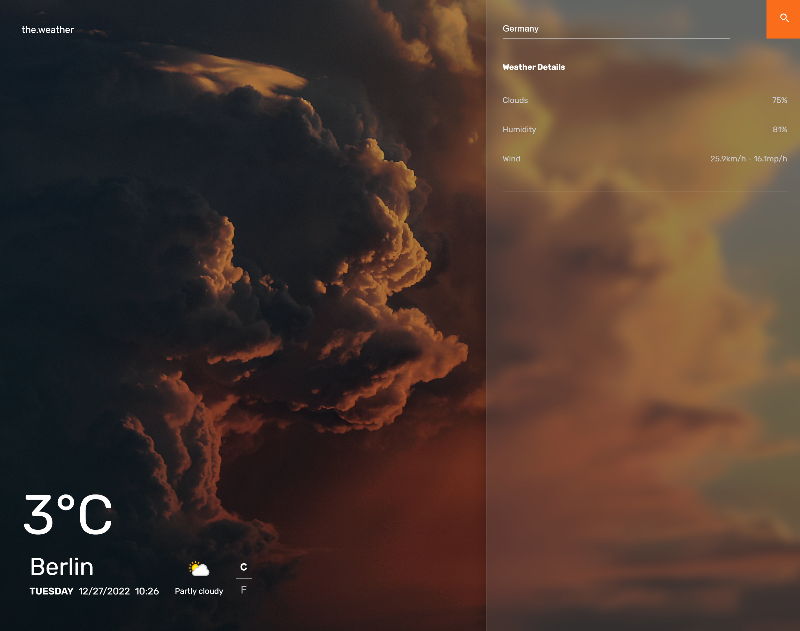
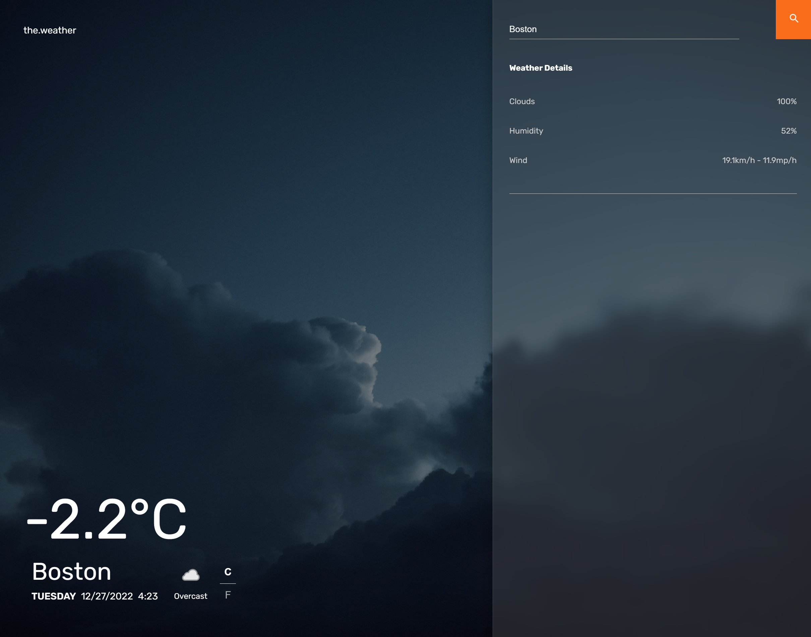

# Responsive Weather Application with React JS and openwaether API

### App fetches real time data from  https://www.weatherapi.com/
---

### Design credits to Arthur K https://dribbble.com/shots/7118235-Weather-DailyUI-037
---

###  Images used for the project
#### https://unsplash.com/photos/h-rP5KSC2W0
#### https://unsplash.com/photos/eXHeq48Z-Q4
#### https://unsplash.com/photos/bWtd1ZyEy6w
#### https://unsplash.com/photos/duo-xV0TU7s
#### https://unsplash.com/photos/PzhmEp_aDU4
#### https://unsplash.com/photos/QjR_snVQn4c
#### https://unsplash.com/photos/rk2s0sm8xF4
#### https://unsplash.com/photos/uj-w-v7OFT4